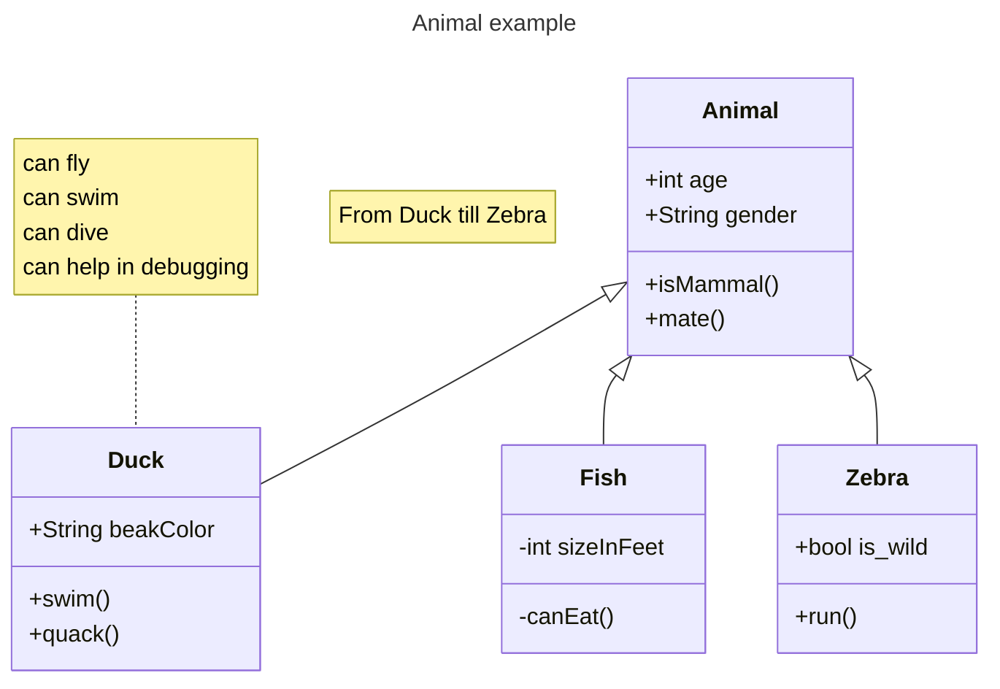

# Class Diagrams

:::caution Starter content - Architecture assignment
This page is not ready for submission until your team replaces this starter outline with project-specific class diagrams and removes this callout.

- Provide class diagrams for the classes your team will develop or use directly.
- Show important attributes, methods, relationships, inheritance, interfaces, and dependencies.
- Explain how each diagram maps to the components described in the System Design page.
:::

## Class Diagram Overview

Replace this section with a short explanation of which parts of the system are covered by the class diagrams.

## Diagram: Replace With Component or Module Name

Replace this section with a class diagram for one major component, module, package, or service. Mermaid class diagrams are preferred when they communicate the design clearly because they are easy to maintain in version control.

## Design Notes

Describe the most important relationships in the diagram. Explain inheritance, composition, interface boundaries, and any classes that are external dependencies rather than code your team owns.
