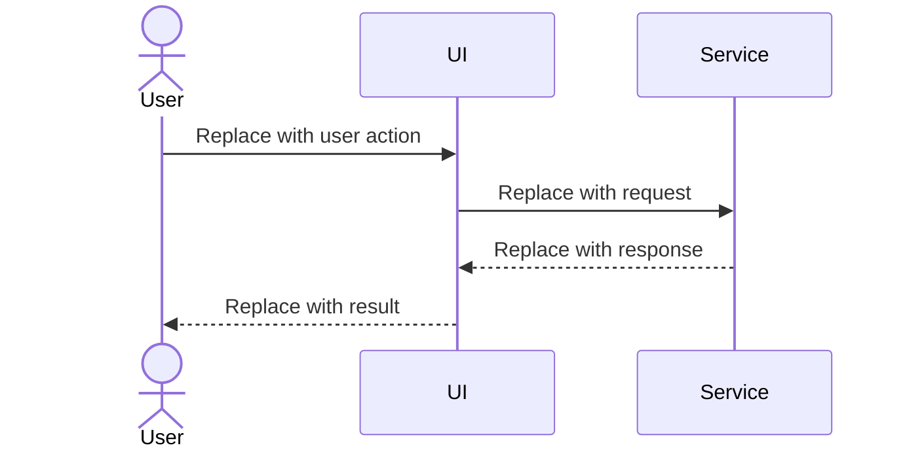

# Sequence Diagrams

:::caution Starter content - Architecture assignment
This page is not ready for submission until your team replaces this starter outline with project-specific sequence diagrams and removes this callout.

- Provide sequence diagrams showing the data flow for all major use cases.
- Use one sequence diagram per use case or clearly labeled scenario.
- Explain how each diagram maps to the use cases from the Requirements Specification.
:::

## Diagram: Replace With Use Case Name

Replace this section with a sequence diagram for one major use case. Mermaid sequence diagrams are preferred when they communicate the flow clearly because they are easy to maintain in version control.

## Flow Notes

Describe the normal flow, alternate flows, important data passed between participants, and any error or exception paths that affect the design.
